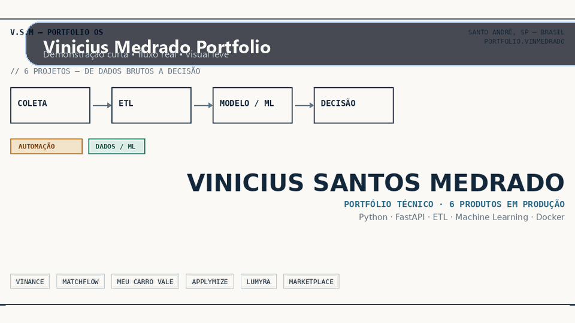
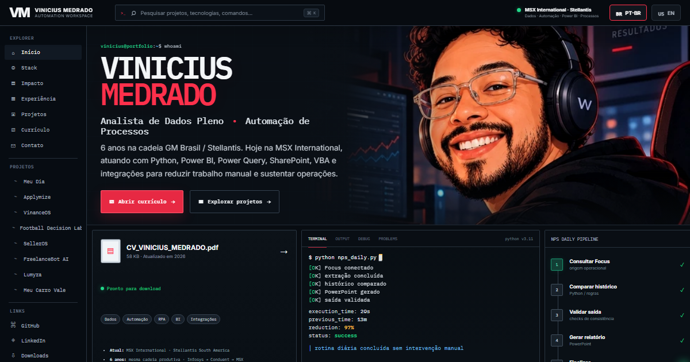

# Vinicius Medrado Portfolio


Portfolio tecnico pessoal em formato de landing page estatica. O site apresenta a trajetoria, os projetos principais, a stack e os links de contato em duas versoes: PT-BR e EN.

## O que este repositorio contem

- `index.html`: versao principal em portugues.
- `index-en.html`: versao em ingles.
- `admin.html`: editor visual do portfolio.
- `projects-data.js`: fonte principal de conteudo.
- `projects-data.en.js`: fonte equivalente em ingles.
- `images/`: capas e screenshots dos projetos.
- `Vinicius_Santos_Medrado.pdf`: curriculo em portugues.
- `Vinicius_Santos_Medrado_EN.pdf`: curriculo em ingles.

## GIF



## Preview



## Tecnologias

- HTML
- CSS
- JavaScript
- JSON-like project data
- GitHub Pages

## Como executar localmente

```bash
python -m http.server 4173
```

Depois abra `http://127.0.0.1:4173`.

## Estrutura

```text
.
|-- admin.html
|-- index.html
|-- index-en.html
|-- projects-data.js
|-- projects-data.en.js
|-- images/
|-- Vinicius_Santos_Medrado.pdf
|-- Vinicius_Santos_Medrado_EN.pdf
```

## Observacoes

- O conteudo do site e editado a partir dos arquivos `projects-data.js` e `projects-data.en.js`.
- O portfolio serve como vitrine principal para recrutadores e clientes.
- Repositorio sem licenca publica definida por decisao do autor.
